### R1 Description of your website, including:
 **Purpose**

  Smoothies have gained fame over the past years for a host of health benefits with the added bonus of being tasty!  And with the internet allowing the exchange of information at wildfire-pace, this app makes use of people’s passion for smoothies! It allows the users to view smoothie recipes from their favourite categories and post comments on what they think of them. It also allows users to post their recipes, so that others can try them and enjoy its goodness! We call this app “Smoothiverse” because we feel it offers the universe of smoothies in terms of variety.

 

**Functionality / features**
- The navbar helps users in easily navigating to the page of their choice
- Registration and authentication of user
- Signed in users can create smoothie recipes of their choice
- Owners of recipes have the ability to edit and delete their listings
- All users can view smoothie recipes
- Signed in users can comment on the posts they like
- Users can filter smoothies on the basis of categories

 

**Target audience**
Smoothiverse appeals to 
- people wanting a post-workout smoothie
- People who have diabetes and want smoothies specific to their diet
- pregnant/breastfeeding women looking for extra nutrients,
- office-goers who want a quick, healthy (and filling!) recipe 
- parents looking to sneak in something nutritious into their children’s meals. 
- those allergic to nuts and looking for nut free smoothie recipes
- those looking for weight-loss recipes
- those who love to tell their Smoothie recipes to the world!

 

 **Tech Stack**
 - MongoDB for storing database entries
 - Mongoose as an Object Document Mapper
 - ExpressJS for server side
 - ReactJS to create the client side of the application
 - NodeJS is the environment in which the express server runs.
 - Passport as authentication middleware for Node
 - CSS and Bootstrap for frontend UI
 - Heroku for Server deployment 
 - Netlify for Client deployment
 - GitHub as a platform for version control 
 - Cypress for front-end testing
 - Figma, Balsamiq and Edraw Max for mood-boarding, wireframes and diagrams
 - CardboardIt for creating user stories in line with Agile
 - Trello as a Project Management Platform
 - Postman for testing HTTP requests

 ### R2 Data flow diagram

 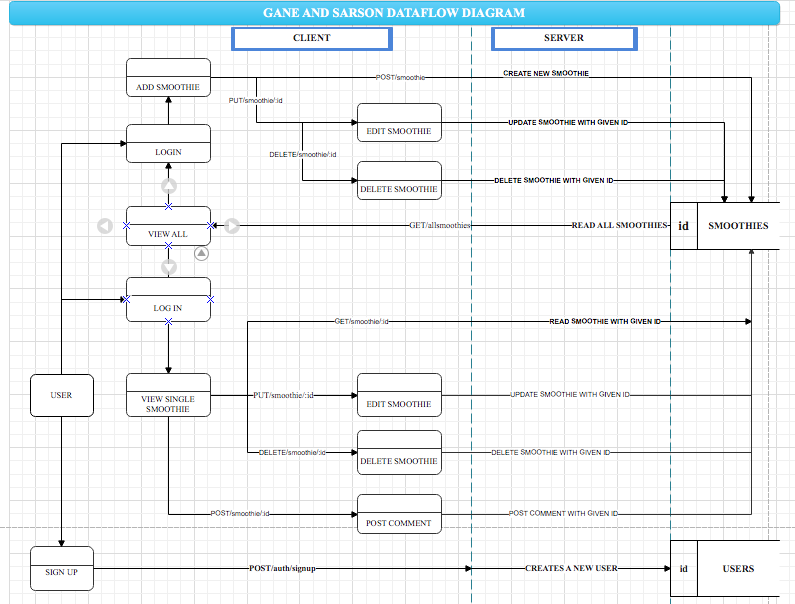
 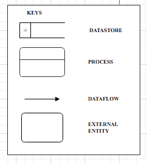
  
### R3 Application Architecture Diagram

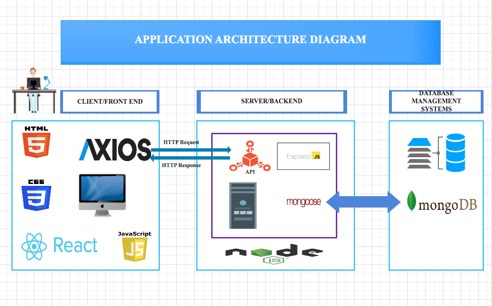

SMOOTHIVERSE ARCHITECTURE DIAGRAM

The architecture of Smoothiverse are composed of frontend client, backend server and  a database management system.  The client makes a request to the server backend and the server fetches the data from the database that manages and stores data of Smoothiverse. The server backend is responsible for retrieving the information from the database and sends the results back to the client frontend. 

Here below is a brief description of the functions of each application;

REACT -  It is a Javascript library which can help to build user interfaces.
 
AXIOS -  Is a Javascript library that helps us perform asynchronous HTTP requests like GET or POST. It can be used from the front-end to gather data from the backend
 
NODE - It is an environment outside of the browser where we can run server side apps in Javascript . Node JS and NPM (Node Package Manager) are installed for the Express environment to run.
 
EXPRESS - It is a Node.js framework that simplifies the task of writing server-side code in web applications and encourages code reusability. Routing in express is the response of an application to an endpoint requested by the client, which is a path and an HTTP request. 
 
MongoDB - Is the database that records and stores the data. 
 
The user from the client side will need to sign up to access more functionalities such as Create/Update/Delete/Search a smoothie recipe. 

 

### Git Workflow
We created a GitHub Organisation for our team inside which we made 3 repos - Client, Server and Docs. The workflow that we discussed to follow was the 'Feature branch workflow'. Each team member works on a feature in their own feature branch - by staging, committing and pushing changes to the feature branch(not the master) in the process. When the feature is ready, before merging to master, a pull request is sent to other team members to review the work done on the feature branch, or incase of any errors/need of discussion. After review, either suggested changes are made(and pull request process is repeated) or the feature branch is merged to the master. Every team member took care to pull the latest version by doing a ‘git pull origin master’ before starting work on a new feature branch.

### R4 User Stories
These are very brief, informal descriptions of the requirements of the website from the user’s point of view. They are usually written in the “As a 'type of' user, I want 'a feature' so that 'reason' format."
These User stories were created on 'CardboardIt' by using cards of different colours for the types of users.
We wrote user stories to get an idea of what features to develop in the app and to show refinements in the user stories that happen in the process of building the app

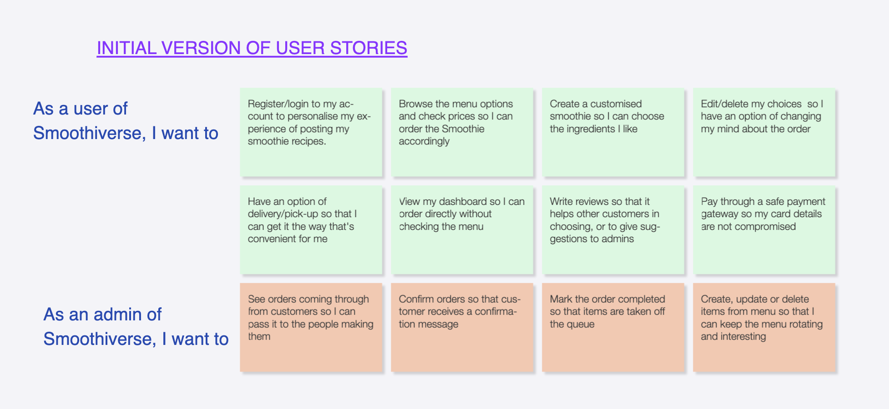

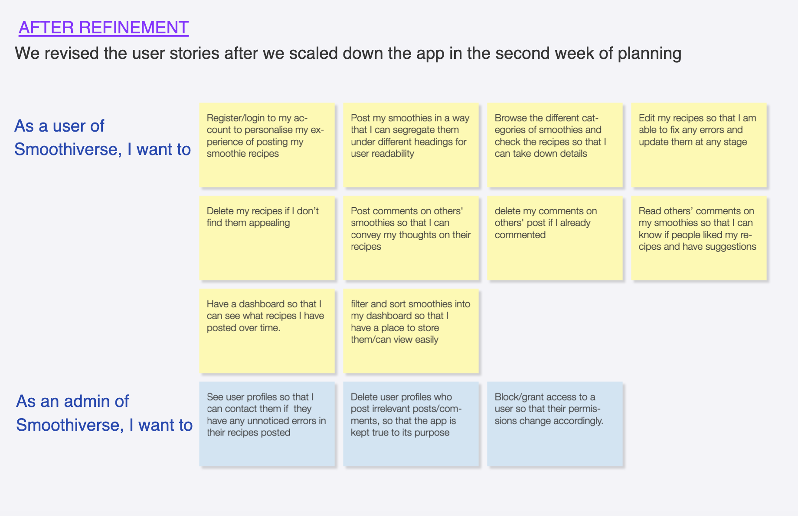

 
###R5 Wireframes, Mockups, and User flow
The lo-fi wireframes were done in Balsamiq. The mockups and user flow were created in Figma!
3 sizes- desktop, mobile and tablet were done

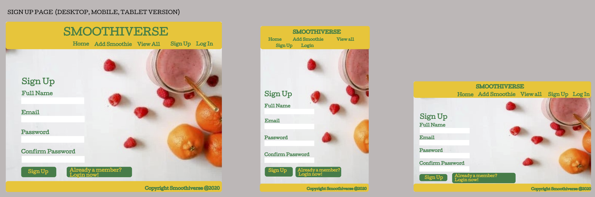
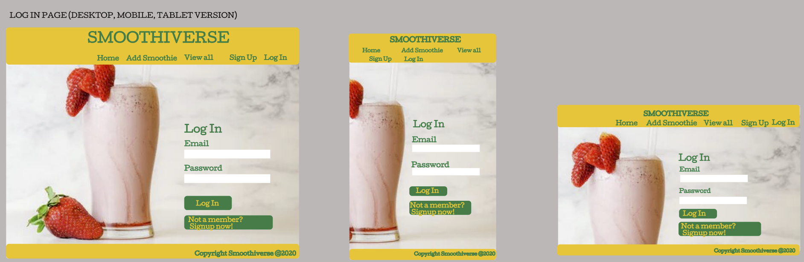

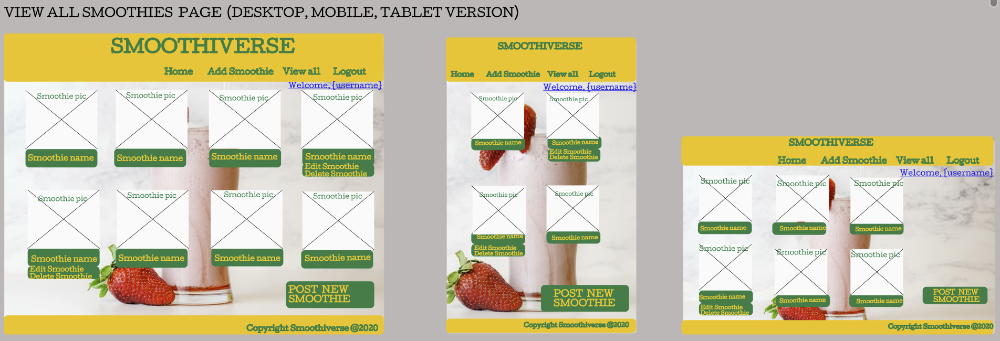
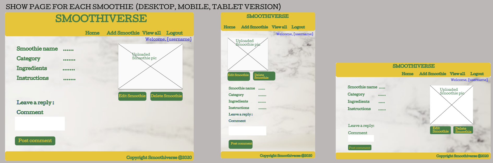
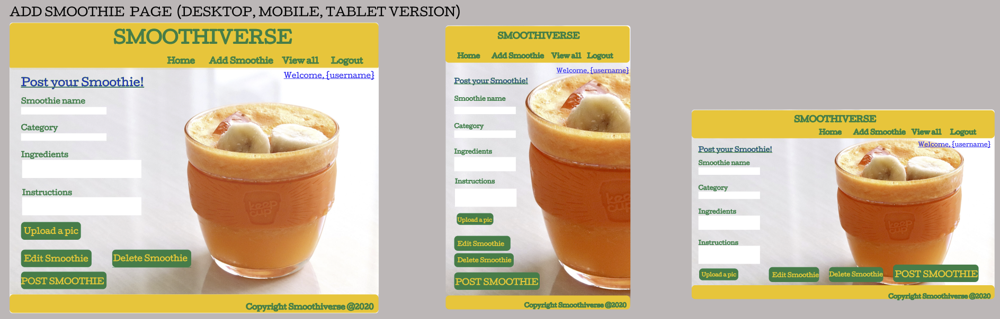
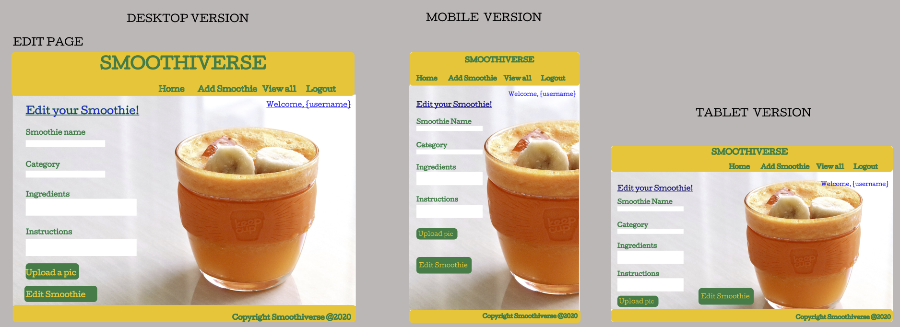

The **user flow** is given below which details the relationship between screens, how the user can interact with the app. The text in blue mentions a few conditions that dictates how pages flow from one to another
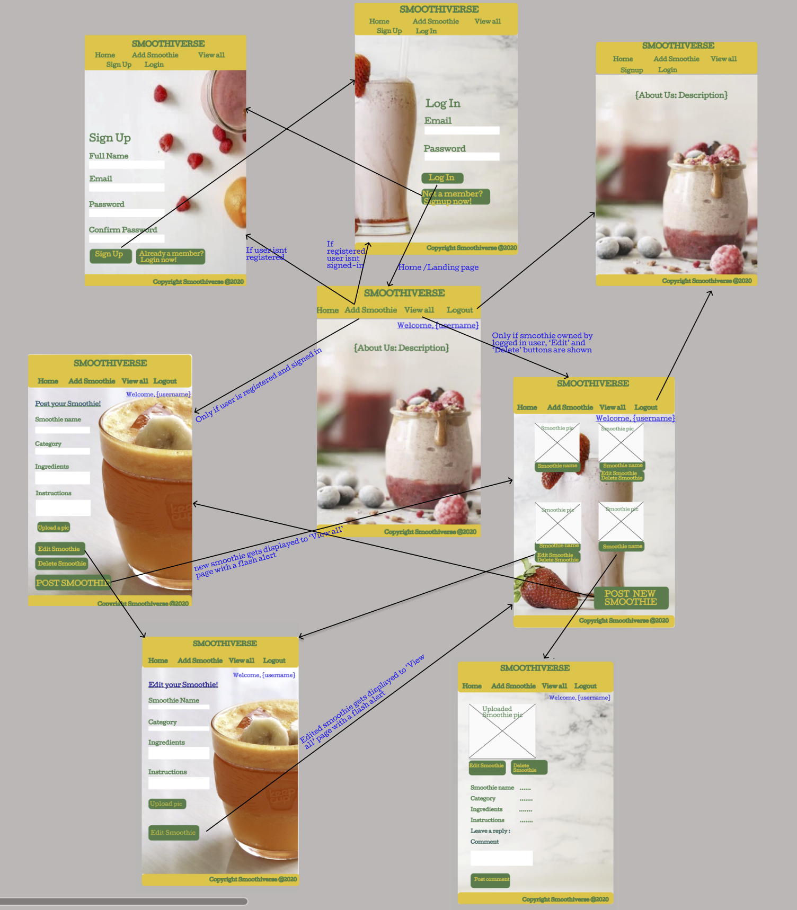

### R6 Screenshots of Trello board demonstrating use throughout the initial stages of the project.

The link for our Trello board:
https://trello.com/b/CJdS4MDn/smoothiverse

We decided to use Trello for Project management to keep in line with the Agile methodology where we put up lists and made cards for tasks. We decided to assign members to specific tasks and wrote down deadline dates. We had cards to write down what we worked on in the span of our 3 class days. We also made ’to-do’ cards for the next 3 day period. The tasks were marked appropriately on the basis of whether they were 'to-do', 'doing', or 'done'.
Since we were following Agile, we also had daily standups before 10am where each one of us would take turns in giving a brief about the work done ‘yesterday’, what’s planned for ’today’ and ’tomorrow’, along with the obstacles faced in the process. This would keep the team updated on how the project is shaping up, and would give each member a sense of responsibility towards their task(and towards their contribution to the project as a whole).
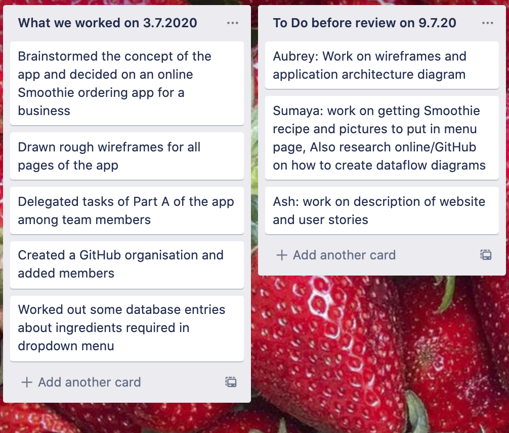
 
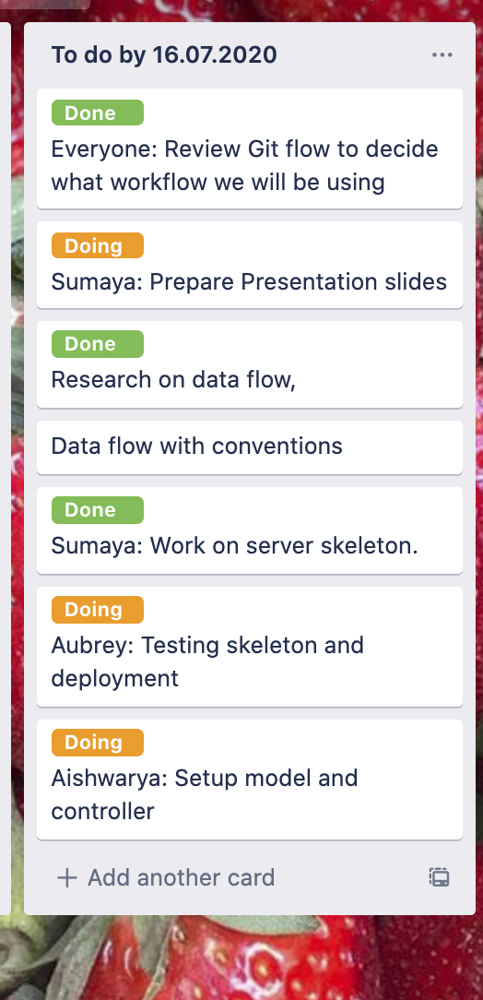
 
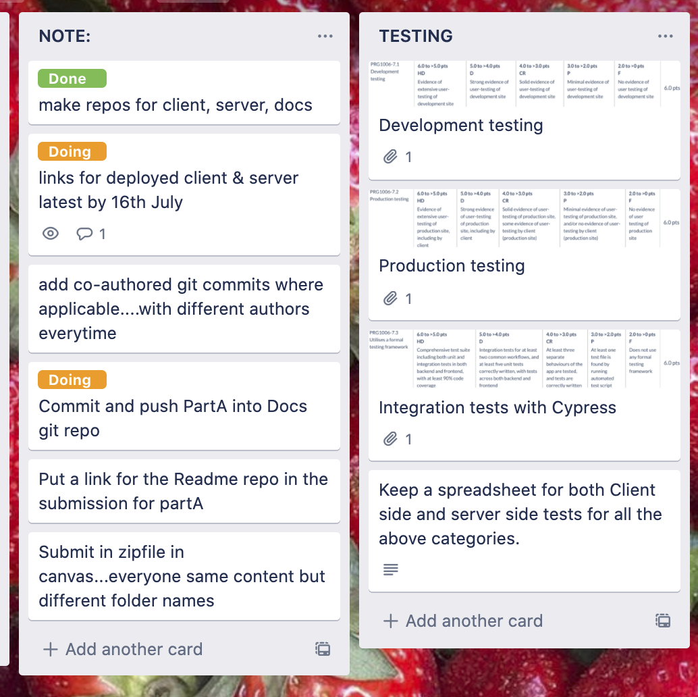
 
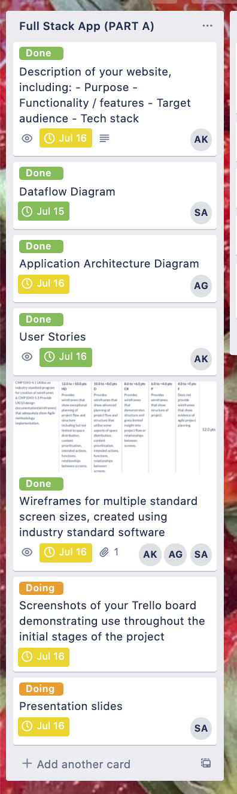
 

